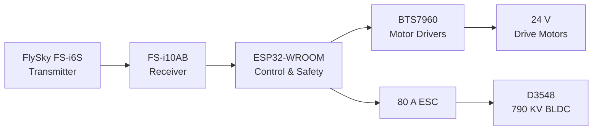
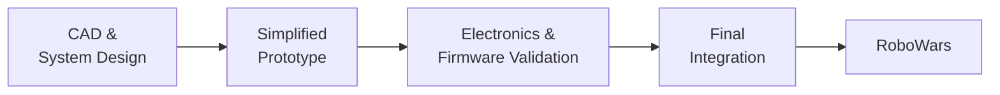

# Battle Bot — 8 kg Vertical Spinner

An 8 kg vertical spinner combat robot designed and built by **Team Spartans** for RoboWars. The robot combines a custom aluminium chassis, impact protection, chain-driven weapon system, differential drivetrain, and an ESP32-based control system.

The project was developed through prototype validation, final integration, testing, and competition.

## Specifications

| Parameter | Specification |
|---|---|
| Robot class | 8 kg |
| Configuration | Vertical spinner |
| Drive | Differential / tank steering |
| Drive motors | 24 V geared DC, ~468 RPM |
| Motor drivers | BTS7960 |
| Wheels | 100 mm |
| Weapon motor | D3548 BLDC, 790 KV |
| Weapon ESC | 80 A, 6S |
| Weapon transmission | Chain and sprocket |
| Controller | ESP32-WROOM |
| Radio | FlySky FS-i6S + FS-i10AB |
| Battery | 2 × 3S 4200 mAh 35C LiPo, series |
| Chassis | Aluminium |
| Side protection | 15 mm UHMWPE + stainless steel |
| Low-voltage supply | XL4051 5 A buck converter |
| Control | RC + ESP32 Web UI |
| Firmware | Custom ESP32 firmware with OTA |

## System Architecture

The ESP32 acts as the control layer between the RC receiver and the actuators, providing signal processing, mixing, control shaping, weapon control, arming, failsafes, configuration, and diagnostics.

## Mechanical Design

The chassis was designed in **SolidWorks** and packaged around the drivetrain, weapon, battery, and electronics.

The final structure uses:

- Aluminium chassis plates
- 15 mm UHMWPE side protection
- Stainless-steel reinforcement
- Integrated mounts for the drivetrain and weapon
- 100 mm heavy-duty wheels

The weapon uses a vertical spinner driven by a **D3548 790 KV BLDC motor** through a chain and sprocket transmission.

The spinner CAD model has a calculated mass of **557.24 g**. This value refers to the spinner model itself and does not include the complete rotating assembly such as the shaft, sprocket, or motor.

## Drivetrain

The robot uses differential steering with independently controlled left and right drive systems.

Each side uses a 24 V geared DC motor rated at approximately:

- **468 RPM**
- **72.6 N·cm torque**

BTS7960 drivers control the drive motors.

The 100 mm drive wheels were fitted with cut cricket-bat grip rubber to improve traction.

## Control System

The ESP32 acts as the control layer between the RC receiver and the actuators.

The firmware handles:

- RC signal processing
- Differential/tank mixing
- Polynomial throttle and steering curves
- Weapon control
- Independent drive and weapon arming
- Radio-loss failsafe
- Watchdog and reset handling
- Web-based configuration and diagnostics
- OTA firmware updates

### Weapon Control

Weapon output can be selected through three transmitter modes:

| Mode | Output |
|---|---:|
| Controlled | ~50% |
| Higher Power | ~90% |
| Full Power | 100% |

The weapon potentiometer provides the normal control input, while the transmitter switch changes its available output range.

## Safety

The robot uses multiple independent safety mechanisms:

- Physical kill switch
- Radio-loss failsafe
- ESP32 watchdog
- Brownout/reset handling
- Emergency/failsafe command
- Independent drivetrain and weapon arming

The drivetrain and weapon can therefore be armed independently during testing and operation.

## Power & Electronics

The main power system uses **two 3S 4200 mAh 35C LiPo batteries in series**, providing a 6S supply:

- Nominal voltage: **22.2 V**
- Fully charged voltage: **25.2 V**
- Capacity: **4200 mAh**

The electrical system includes an 80 A weapon ESC, BTS7960 motor drivers, XL4051 buck converter, TVS protection, AWG 10 high-current wiring, XT60 connectors, and a 24 V cooling fan.

## Development

The robot was developed in stages rather than integrating the final combat system immediately.

The prototype was used to validate the ESP32 control system, RC communication, motor control, weapon control, mixing, and safety logic before the final chassis was fabricated.

The prototype used a direct flexible weapon coupling, while the final robot used the chain-and-sprocket transmission.

## Competition & Failure

The completed robot competed at **RoboWars** and reached Round 2.

During combat, the **weapon transmission sprocket broke under loading**, stopping the weapon and contributing to the loss.

The failure exposed a limitation that was not apparent during normal testing: combat introduces transient shock loads significantly different from steady-state operation. It highlighted the need to consider impact loading and transmission component strength when designing combat mechanisms.

## My Contribution

This was a team project under **Team Spartans**. My work covered the mechanical design, electronics integration, embedded control, and system integration.

### Mechanical

- Designed the main chassis in SolidWorks
- Worked on internal packaging and component placement
- Designed the weapon mounting/support structure
- Worked on drivetrain and weapon transmission design

### Electronics & Control

- Designed and integrated the electronics architecture
- Developed the ESP32 control system
- Implemented mixing and polynomial control curves
- Implemented weapon control and power modes
- Implemented arming and failsafe logic
- Developed the Web UI and OTA functionality

### Integration

- Validated the prototype
- Integrated mechanical, electrical, and software systems
- Worked on final assembly and testing

## Project Status

**Completed — Competed at RoboWars**

The robot reached competition, with the weapon transmission sprocket failing during Round 2.

## License

This project is released under the [MIT License](LICENSE).
